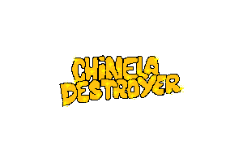

<p align="center">
  
</p>

---

## Sobre o jogo

**Chinela Destroyer** é um jogo de plataforma infinita feito com [Phaser 3](https://phaser.io/) e TypeScript. O jogador controla a Chinela que precisa subir o mais alto possível pulando entre plataformas, enquanto avança em direção da Pera atirando armadilhas.

O jogo fica cada vez mais difícil conforme você sobe: a câmera acelera progressivamente, pressionando você para cima. Caia fora da tela ou seja atingido por uma armadilha — game over.

---

## As protagonistas

<p align="center">
  
  <br/>
  <em>as protagonistas são essas gatas endeotas</em>
</p>

---

## Como jogar

| Ação | Teclado | Mobile |
|------|---------|--------|
| Mover para a esquerda | `←` ou `A` | Botão esquerdo |
| Mover para a direita | `→` ou `D` | Botão direito |
| Pular | `↑` ou `W` | Botão pular |
| Pausar | `Esc` | Botão pause |

- O personagem **atravessa as bordas** da tela (sai pela esquerda, entra pela direita e vice-versa).
- **Evite as armadilhas** lançadas pela pera — ela pisca antes de jogar, te dando um aviso.
- Quanto mais alto chegar, maior sua pontuação em **Altura**.

---

## Mecânicas

- **Scroll automático acelerado** — a câmera sobe continuamente e vai ficando cada vez mais rápida.
- **Plataformas geradas proceduralmente** — cada partida tem um layout diferente.
- **Inimigo com IA simples** — a pera se move horizontalmente no topo da tela e mira as armadilhas diretamente no jogador.
- **Controles touch** — suporte completo a dispositivos móveis com botões virtuais na tela.

---

## Tecnologias

- [Phaser 3](https://phaser.io/) — engine de jogos 2D
- [TypeScript](https://www.typescriptlang.org/)
- [Vite](https://vitejs.dev/) — bundler e dev server

---

## Rodando localmente

```bash
npm install
npm run dev
```

Acesse `http://localhost:5173` no navegador.

Para gerar o build de produção:

```bash
npm run build
```

---

## Créditos

Feito por **Deustavo** — [github.com/Deustavo](https://github.com/Deustavo/chinela-destroyer)
